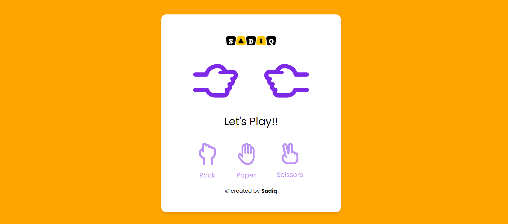

# Rock, Paper, Scissors Game



This is a simple web-based Rock, Paper, Scissors game implemented using HTML, CSS, and JavaScript. It allows users to play the classic game against the computer.

## Table of Contents

- [Demo](#demo)
- [Features](#features)
- [Getting Started](#getting-started)
- [How to Play](#how-to-play)
- [Customization](#customization)
- [License](#license)

## Demo

You can play the game online [here](http://rpsgame.sadiqmagbul.host20.uk/).

## Features

- Classic Rock, Paper, Scissors gameplay.
- User-friendly interface with responsive design.
- Real-time results display.
- Computer AI opponent.

## Getting Started

To run this game locally, follow these steps:

1. Clone this repository to your local machine:

   ```bash
   git clone https://github.com/sadiqshaik123/Rock-paper-scissor-game.git

## How to Play

1. **Open the Game**: Open the game in your web browser.

2. **Choose Your Move**: Make your move by clicking on one of the three options: Rock, Paper, or Scissors.

3. **Computer's Move**: The computer will randomly select its move.

4. **Game Result**: The result of the game will be displayed on the screen, indicating whether you won, lost, or it's a tie.

5. **Play Again**: To start a new round, simply click the "Play Again" button.

## Customization

You have the freedom to customize the game to your liking. Here's how:

- **styles.css**: Customize the game's visual style by editing the CSS in the `styles.css` file. Change colors, fonts, and layout to match your preferences.

- **script.js**: Adjust the game logic or add new features by modifying the JavaScript code in the `script.js` file. You can experiment with different game rules or even implement additional game modes.

Feel free to make any changes and enhancements according to your creative ideas.

## License

This project is open-source and is licensed under the MIT License. You can find the full details of the license in the [LICENSE](LICENSE) file included in this repository. The MIT License allows you to use, modify, and distribute this project freely, subject to the terms and conditions specified in the license.

Please ensure that you adhere to the terms of the MIT License when using or sharing this project.

